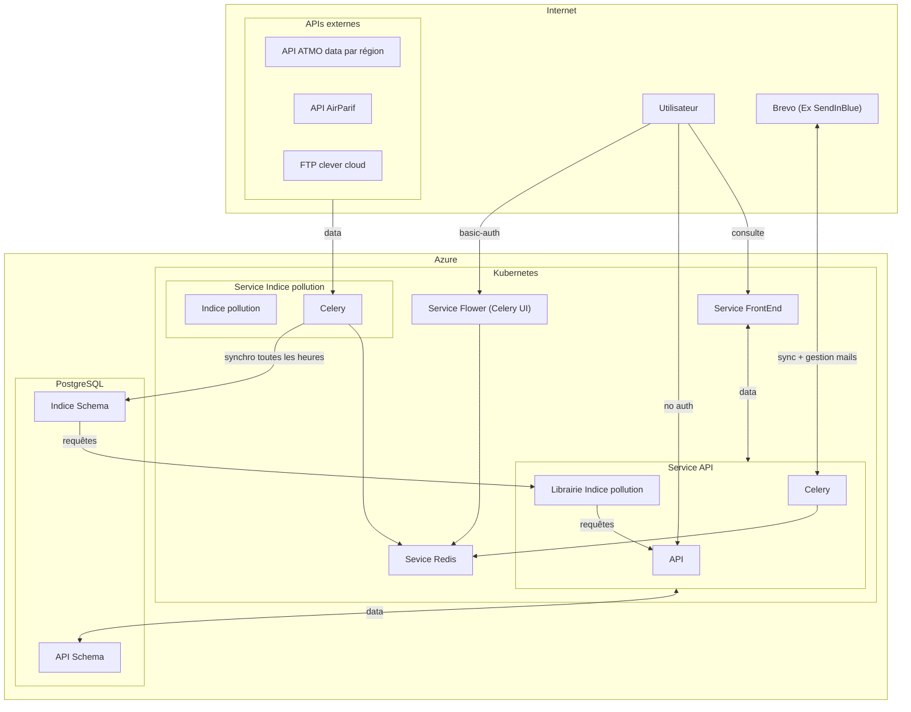

# Recosante

Recosante : Un service public numérique de recommandations d'actions pour réduire l'impact de l'environnement sur sa santé.

Accessible sur https://recosante.beta.gouv.fr/

Ce dépôt est un monorepo créé pour faciliter le déploiement sur l'infrastructure de la [Fabrique numérique des ministères sociaux](https://fabrique.social.gouv.fr).

Les sous-dossiers ont été repris du travail effectué par l'équipe dédiée de beta.gouv.fr, à partir des dépôts suivant :

- https://github.com/betagouv/recosante : frontend
- https://github.com/betagouv/recosante-api : data, envoi des emails
- https://github.com/betagouv/recosante-mail : templates email
- https://github.com/betagouv/indice_pollution : import des indices et utilisation via l’API

## Brève description

Recosanté est composé de trois services :

- Une API d’exposition des indicateurs qui est dans ce dépot, techniquement il s’agit d’une API écrite en python avec le framework Flask.
  Cette API sert aussi à gérer les abonnements au service.

- Un service qui envoie les newsletters, techniquement c’est un worker celery qui est passe toutes les heures pour voir s’il doit envoyer des mails ou bien des notifications web.

- Un service qui sauvegarde les différents indices (indice ATMO, épisodes de pollution, Risque d'allergie lié à l'exposition aux pollens (RAEP), vigilance météo, indice UV). Le code de ce service se trouve [ici](./libs/indice_pollution).

Les données sont stockées dans une base de données postgresql, dans le schéma public pour les données d’abonnements, et dans le schéma `indice_schema` pour les données de prévisions des différents indices renvoyés.

## Structure et projets

### indice_pollution

Ce projet utilise [`celery`](https://docs.celeryq.dev/en/stable/index.html) pour interroger différentes API (AirParif, indice ATMO régionaux, ...) et alimenter sa propre base de données (shema `indice_schema`) toutes les heures.

Il s'exporte de plus comme une librairie utilisable par nimporte quel projet.

Plus d'information dans le [`README.md`](./libs/indice_pollution/README.md) du projet.

### api

Ce projet utilise également [`celery`](https://docs.celeryq.dev/en/stable/index.html) pour générer des envois de mails aux utilisateurs ayant souscrit à la newsletter via Brevo (ex sendInBlue). Il contient une API [`flask`](https://flask.palletsprojects.com/en/2.3.x/) qui sert la data nécessaire au site web. Il comporte un schema propre lui permettant de stocker les utilisateurs, newsletters et incriptions. Il utilise enfin la librarie `indice_pollution` pour interroger le schema `indice_schema`.

Plus d'information dans le [`README.md`](./api/README.md) du projet.

### frontend

Ce projet est le site recosanté. Il utilise [Gatsby](https://www.gatsbyjs.com/).

Plus d'information dans le [`README.md`](./frontend/README.md) du projet.

### mail

Ce projet contient les templates mails utilisés par Brevo (ex sendInBlue).

Plus d'information dans le [`README.md`](./mail/README.md) du projet.

### Stack technique

Notre stack technique est principalement composée de :

- front-end : React, Gatsby.
- back-end : Python, Flask, Celery / Redis, PostgreSQL.
- hébergement et autres services : Docker, Kubernetes, Brevo (ex Sendinblue).

### Schéma simplifié d'architecture



## Récolte des données pour les indicateurs

### Baignades

1. [le frontend](frontend/src/hooks/useBaignades.js) utilise le code INSEE de la commune pour requêter le backend
2. de ce code INSEE on requête notre base de données (table indice_schema/commune) qui contient 35096 communes, afin de récupérer le code du département (01, 02, 03...)
3. de ce code département on récupère aussi un `idCarte` (`fra`, `reu`, `may`, `guy`, `mar`...)
4. on exécute une requête non authentifiée vers `https://baignades.sante.gouv.fr/baignades/siteList.do?idCarte={0}&insee_com={1}&code_dept={2}&f=json` avec les paramètres récupérés précédemment afin de récupérer la liste des sites de baignades concernés
5. on crée un code département `dptddass` (le code département en 3 chiffres, précédés de 0 si nécessaire)
6. on extrait de la requête effectuée en 4 un `isite` grâce auquel on compose un nouvel id de site `idSite` (`{dptddass}{isite}`)
7. on calcule l'année concernée, différente selon les hémisphères
8. on exécute une requête non authentifiée vers `https://baignades.sante.gouv.fr/baignades/consultSite.do?dptddass={0}&site={1}&annee={2}` qui renvoie un html
9. on parse ce html afin de retrouver les informations que l'on souhaite: Début de la saison, Fin de la saison, Interdictions le cas échéant, Observations, Échantillons, Rang.
10. on [renvoie au frontend](https://github.com/SocialGouv/recosante/blob/master/api/ecosante/api/baignades.py#L65) l'ensemble des informations disponibles

### Potentiel Radon

Le Potentiel Radon n'est pas une donnée dynamique

1. [le frontend](frontend/src/hooks/useBaignades.js) utilise le code INSEE de la commune pour requêter le backend
2. de ce code INSEE on requête notre base de données (table indice_schema/potentiel_radon) qui contient 35002 communes, afin de récupérer le potentiel (entre 1 et 3)
3. on [renvoie au frontend](https://github.com/SocialGouv/recosante/blob/master/api/ecosante/api/blueprint.py#L89)

### Indice UV

1. chaque matin à 7h un fichier `YYYYMMDD.csv` contenant les indices UV de la journée est déposé par une tierce partie sur un bucket Clever Cloud. Ce fichier est structuré de cette manière pour quelques 36608 communes: `Code insee`, `Commune`, `Date`, `UV_J0`, `UV_J1`, `UV_J2`, `UV_J3`.
2. un [cron job](https://github.com/SocialGouv/recosante/blob/master/libs/indice_pollution/indice_pollution/__init__.py#148) est exécuté toute les heures pour se connecter via FTP au bucket et [récupérer les indices UV](https://github.com/SocialGouv/recosante/blob/master/libs/indice_pollution/indice_pollution/history/models/indice_uv.py#L30).
3. toutes les données sont enregistrées en base de données dans la table `indice_schema/indice_uv` (19 millions de lignes fin août 2023)
4. ainsi pour chaque requête du frontend, on requête notre base de données et on [renvoie au frontend](https://github.com/SocialGouv/recosante/blob/master/api/ecosante/api/blueprint.py#L130)

### RAEP (Risque d'allergie lié à l'exposition aux pollens)

2. un [cron job](https://github.com/SocialGouv/recosante/blob/master/libs/indice_pollution/indice_pollution/__init__.py#143) est exécuté toute les heures pour [faire une requête](https://github.com/SocialGouv/recosante/blob/master/libs/indice_pollution/indice_pollution/history/models/raep.py#L81) non authentifiée vers `https://www.pollens.fr/docs/ecosante.csv` qui renvoie un csv avec toutes les données à une date précise pour chaque département de France métropolitaine
3. on parse ce CSV et on alimente notre base de données dans la table `indice_schema/raep`
4. le frontend fait une requête avec le code INSEE de la commune, et le backend trouve le code département associé
5. ainsi pour chaque requête du frontend, on requête notre base de données et on [renvoie au frontend](https://github.com/SocialGouv/recosante/blob/master/api/ecosante/api/blueprint.py#L120)

### Vigilance météo

2. un [cron job](https://github.com/SocialGouv/recosante/blob/master/libs/indice_pollution/indice_pollution/__init__.py#145) est exécuté toute les heures pour [faire une requête](https://github.com/SocialGouv/recosante/blob/master/libs/indice_pollution/indice_pollution/history/models/vigilance_meteo.py#L77) authentifiée vers `https://public-api.meteofrance.fr/public/DPVigilance/v1/cartevigilance/encours` qui renvoie un JSON avec touts les données à la date d'aujourd'hui
3. ce json est parsé et on alimente notre base de données dans la table `indice_schema/vigilance_meteo`, avec des données par département
4. le frontend fait une requête avec le code INSEE de la commune, et le backend trouve le code département associé
5. ainsi pour chaque requête du frontend, on requête notre base de données et on [renvoie au frontend](https://github.com/SocialGouv/recosante/blob/master/api/ecosante/api/blueprint.py#106)

### Indices ATMO

Cette partie est la plus délicate :) puisqu'elle nécessite de récupérer des données de beaucoup de sources différentes, par région

#### Auvergne-Rhône-Alpes

#### Bourgogne-Franche-Comté

#### Bretagne

#### Centre-Val de Loire

#### Corse

#### Grand Est

#### Guadeloupe

#### Guyane

#### Hauts-de-France

#### Île-de-France

#### Martinique

#### Mayotte

#### Normandie

#### Nouvelle-Aquitaine

#### Occitanie

#### Pays de la Loire

#### Réunion

#### Sud

## Développement

### Requirements

Le projet est basé sur les outils suivant

```
# Environnements conteneurisés
docker
docker-compose

# Projets python
python
pip
poetry

# Projets JavaScript
node
npm
yarn
```

Si vous souhaitez lancer le projet en local, nous vous invitons à installer tous ces binaires et à les avoir diponibles dans le `PATH` de votre terminal.

### Lancer tous les services

Tous les services peuvent être lancés via la commande

```bash
yarn start
```

ou

```bash
docker-compose up
```

### Lancer les services en local

Merci de vous référer au `README.md` de chaque projet que vous souhaitez lancer en local. Gardez en mémoire que ces projets ont besoin d'autres services pour fonctionner (base de données, redis...). Afin de lancer en local le minimum nécessaire à l'exécution de chaque projet, vous pouvez utiliser la commande

```bash
yarn up
```

### Stopper les conteneurs

A tout moment, vous pouvez stopper les conteneurs docker via les commandes

```bash
yarn stop
```

ou

```bash
docker-compose stop
```

Stoppera les conteneurs

```bash
yarn down
```

ou

```bash
docker-compose down
```

Stoppera et supprimera les conteneurs

Les volumes bases de données seront conservés. Si vous souhaitez les supprimer, veuillez le faire manuellement avec `docker volume`.

### Tester

Afin d'exécuter les tests unitaires, merci de vous référer au `README.md` de chaque projet afin de préparer les variables d'environnement nécessaires. Une fois les instructions complétées, vous pouvez utiliser la commande

```bash
yarn test
```

à la racine du projet.

### Linter

Afin d'exécuter le lint, merci de vous référer au `README.md` de chaque projet afin de préparer les dépendances nécessaires. Une fois les instructions complétées, vous pouvez utiliser la commande

```bash
yarn lint
```

Le projet utilise [pylint](https://github.com/pylint-dev/pylint). Pour autoformatter votre code avec `vsCode`, nous vous conseillons les extensions suivantes

- [Pylint](https://github.com/microsoft/vscode-pylint)
- [Pylance](https://github.com/microsoft/pylance-release)
- [isort](https://github.com/microsoft/vscode-isort)
- [autopep8](https://github.com/microsoft/vscode-autopep8)

`Nota Bene`

Lorsque vous développez sur la librairie `indice_pollution` ou sur l'`api`, vous devez utiliser leur virtual environnement respectifs. Cela peut être fait sous vscode en utilisant la commande `command + shift + p`, puis `Python: Select Interpreter` et choisir celui que vous souhaitez dans la liste afin que les dépendances soient résolues correctement.

Il faut que les `.venv` des projets soient installés avec `poetry` pour que `vsCode` les détecte. Merci de vous référer aux `README.md` de chaque projet.

`pylint` va vérifier l'ordre des imports. Pour les formatter automatiquement, nous vous conseillons d'utiliser `isort`. Cependant, il y a une limitation d'`isort` considérant les répertoires locaux comme des libraries. Vous pouvez lui spécifier de la configuration via vos settings `vsCode` (`settings.json` racine ou workspace).

```json
{
  "isort.args": ["--known-local-folder", "ecosante", "--known-local-folder", "tests"]
}
```

Pour l'`api`

```json
{
  "isort.args": ["--known-local-folder", "indice_pollution"]
}
```

Pour la librairie `indice_pollution`

## Contribution et deploiement continu

Chaque contribution fonctionnelle se fait sous la forme de pull-requests.

A chaque création et mise à jour de pull-request, une nouvelle version de l’application est déployée sur le cluster kubernetes de la fabrique dans un environnement de démo (preview) qui lui est propre.

Une fois la pull-request validée, le merge dans la branche master va déclencher le déploiement dans l'environnement de pré-production sans interruption de service.

Pour déployer en production, une task github est disponible.

## Licence

Apache 2.0 - Direction du numérique des ministère sociaux.

Voir [LICENSE](./LICENSE)
