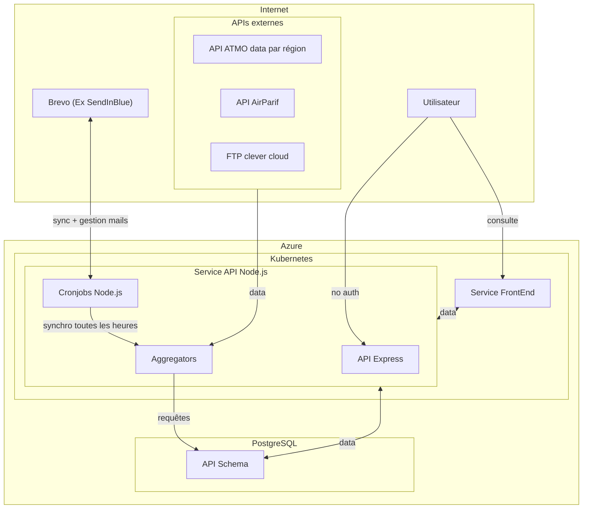

# Recosante

Recosante : Un service public numérique de recommandations d'actions pour réduire l'impact de l'environnement sur sa santé.

Accessible sur https://recosante.beta.gouv.fr/

Ce dépôt est un monorepo créé pour faciliter le déploiement sur l'infrastructure de la [Fabrique numérique des ministères sociaux](https://fabrique.social.gouv.fr).

Les sous-dossiers ont été repris du travail effectué par l'équipe dédiée de beta.gouv.fr, à partir des dépôts suivants :

- https://github.com/betagouv/recosante : frontend
- https://github.com/betagouv/recosante-api : API Node.js, data, envoi des emails
- https://github.com/betagouv/recosante-mail : templates email

L'application mobile est développée dans un dépôt séparé :
- https://github.com/SocialGouv/recosante-expo-app : application mobile React Native

## Brève description

Recosanté est composé de trois services :

- Une API d'exposition des indicateurs qui est dans ce dépot, techniquement il s'agit d'une API écrite en Node.js avec Express.
  Cette API sert aussi à gérer les abonnements au service.


- Un service qui sauvegarde les différents indices (indice ATMO, épisodes de pollution, Risque d'allergie lié à l'exposition aux pollens (RAEP), vigilance météo, indice UV). Le code de ce service se trouve dans le dossier `api-node/src/aggregators`.

Les données sont stockées dans une base de données PostgreSQL, dans le schéma public pour les données d'abonnements et les données de prévisions des différents indices renvoyés.

## Structure et projets

### api-node

Ce projet utilise Node.js avec Express etcontient une API qui sert la data nécessaire au site web. Il comporte un schema propre lui permettant de stocker les utilisateurs. Il utilise Prisma comme ORM pour interroger la base de données PostgreSQL.

Plus d'information dans le [`README.md`](./api-node/README.md) du projet.

### frontend

Ce projet est le site recosanté. Il utilise [Next.JS](https://nextjs.org).

Plus d'information dans le [`README.md`](./frontend/README.md) du projet.

### Application mobile

L'application mobile Recosanté est développée en React Native avec Expo et consomme l'API Node.js. Elle est hébergée dans un dépôt séparé : [recosante-expo-app](https://github.com/SocialGouv/recosante-expo-app).

Plus d'information dans le [`README.md`](https://github.com/SocialGouv/recosante-expo-app/blob/main/README.md) du projet mobile.


### Stack technique

Notre stack technique est principalement composée de :

- front-end : React, Next.js.
- mobile : React Native, Expo.
- back-end : Node.js, Express, Prisma, PostgreSQL.
- hébergement et autres services : Docker, Kubernetes.

## Architecture Node.js - Clean Architecture

L'API Node.js suit les principes de la **Clean Architecture** avec une séparation claire des responsabilités et des couches bien définies.

### 🏗️ Structure des couches

```
src/
├── controllers/          # Couche Interface (HTTP)
├── services/            # Couche Application (Logique métier)
├── aggregators/         # Couche Infrastructure (Récupération données externes)
├── getters/             # Couche Infrastructure (Accès aux données)
├── cronjobs/            # Couche Infrastructure (Tâches planifiées)
├── middlewares/         # Couche Interface (Validation, Auth, etc.)
├── schemas/             # Couche Interface (Validation Zod)
├── types/               # Couche Domain (Types TypeScript)
└── utils/               # Couche Infrastructure (Utilitaires)
```

### 🔧 Composants principaux

#### **Controllers** (Interface Layer)
- **Responsabilité** : Gestion des requêtes HTTP et orchestration
- **Principe** : Couche la plus externe, ne contient que la logique de routage
- **Exemple** : `user.ts`, `indicators.ts`, `notification.ts`
- **Pattern** : Validation → Service → Réponse

```typescript
// Exemple de contrôleur
export async function updateUser(req: Request, res: Response) {
  const validatedData = await validateBody(updateUserSchema)(req);
  const result = await UserService.updateUser(matomoId, validatedData, req.headers);
  res.json(result);
}
```

#### **Services** (Application Layer)
- **Responsabilité** : Logique métier et orchestration des cas d'usage
- **Principe** : Indépendant de l'infrastructure, testable en isolation
- **Exemple** : `user.service.ts`, `eventService.ts`
- **Pattern** : Use Cases, Business Rules

```typescript
// Exemple de service
export async function updateUser(matomoId: string, updateData: UserUpdateData): Promise<User> {
  // Logique métier : normalisation des données
  const normalizedData = normalizeUserData(updateData);
  
  // Orchestration : appel aux repositories
  const user = await prisma.user.upsert({
    where: { matomo_id: matomoId },
    update: normalizedData,
    create: { matomo_id: matomoId, ...normalizedData }
  });
  
  return user;
}
```

#### **Aggregators** (Infrastructure Layer)
- **Responsabilité** : Récupération et agrégation des données externes
- **Principe** : Isolation des APIs externes, gestion des erreurs
- **Exemple** : `indice_atmo.ts`, `pollens/`, `weather_alert.ts`
- **Pattern** : Adapter Pattern, Retry Logic

```typescript
// Exemple d'aggregator
export async function getAtmoIndicator(): Promise<void> {
  try {
    // Récupération des données externes
    const externalData = await fetchAtmoData();
    
    // Transformation et validation
    const processedData = transformAtmoData(externalData);
    
    // Persistance
    await prisma.indiceAtmospheric.createMany({
      data: processedData,
      skipDuplicates: true
    });
  } catch (error) {
    capture(error, { extra: { functionCall: 'getAtmoIndicator' } });
    throw error;
  }
}
```

#### **Getters** (Infrastructure Layer)
- **Responsabilité** : Accès aux données pour l'API
- **Principe** : Interface uniforme pour la récupération des données
- **Exemple** : `indice_atmo.ts`, `pollens.ts`, `weather_alert.ts`
- **Pattern** : Repository Pattern, Data Access Layer

```typescript
// Exemple de getter
export async function getIndiceAtmoFromMunicipalityAndDate({
  municipality_insee_code,
  date_UTC_ISO
}: GetIndiceAtmoParams): Promise<Indicator> {
  // Validation des paramètres
  validateParams({ municipality_insee_code, date_UTC_ISO });
  
  // Récupération des données
  const data = await prisma.indiceAtmospheric.findFirst({
    where: {
      municipality_insee_code,
      validity_start: { lte: new Date(date_UTC_ISO) },
      validity_end: { gte: new Date(date_UTC_ISO) }
    }
  });
  
  // Transformation en format API
  return transformToIndicatorFormat(data);
}
```

#### **Cronjobs** (Infrastructure Layer)
- **Responsabilité** : Exécution des tâches planifiées
- **Principe** : Orchestration des aggregators, gestion des erreurs
- **Exemple** : `aggregators.ts`, `notifications.ts`, `cleaning.ts`
- **Pattern** : Scheduler Pattern, Error Recovery

```typescript
// Exemple de cronjob
export async function initAggregators() {
  const aggregators = [
    () => getAtmoIndicator(),
    () => getIndiceUVIndicator(),
    () => getWeatherAlert(),
    () => getBathingWaterIndicator(),
    () => getPollensIndicator(pollensLoggerUtils, pollensApiService)
  ];
  
  for (const aggregator of aggregators) {
    try {
      await aggregator();
    } catch (error) {
      capture(error, { extra: { functionCall: 'initAggregators' } });
      // Continue avec les autres aggregators
    }
  }
}
```

### 🧪 Architecture des tests

#### **Tests unitaires** (`__tests__/unit/`)
- **Objectif** : Tester les composants en isolation
- **Couverture** : Services, Utils, Schemas, Event Handlers
- **Pattern** : Mock des dépendances externes
- **Configuration** : `jest.unit.config.cjs`

```typescript
// Exemple de test unitaire
describe('UserService', () => {
  it('should normalize favorite indicators array', async () => {
    const mockPrisma = {
      user: {
        upsert: jest.fn().mockResolvedValue(mockUser)
      }
    };
    
    const result = await UserService.updateUser('test-id', {
      favorite_indicators: ['pollen_allergy', 'weather_alert']
    });
    
    expect(result.favorite_indicator).toBe('pollen_allergy');
  });
});
```

#### **Tests d'intégration** (`__tests__/integration/`)
- **Objectif** : Tester les interactions entre composants
- **Couverture** : Controllers, Base de données, APIs externes
- **Pattern** : Base de données de test, Mocks partiels
- **Configuration** : `jest.integration.config.cjs`

```typescript
// Exemple de test d'intégration
describe('User Controller Integration', () => {
  beforeEach(async () => {
    await prisma.user.deleteMany();
  });
  
  it('should create user and return correct response', async () => {
    const response = await request(app)
      .post('/user')
      .send({ matomo_id: 'test-123' });
    
    expect(response.status).toBe(200);
    expect(response.body.matomo_id).toBe('test-123');
  });
});
```

### 🔄 Flux de données

#### **Requête API** (Read)
```
Client → Controller → Service → Getter → Database → Response
```

#### **Tâche planifiée** (Write)
```
Cronjob → Aggregator → External API → Transform → Database
```

#### **Gestion d'événements**
```
Event → EventHandler → Service → Database → Notification
```

### 🛡️ Principes appliqués

#### **Dependency Inversion**
- Les services ne dépendent pas directement de Prisma
- Injection de dépendances via interfaces
- Tests facilités par le mocking

#### **Single Responsibility**
- Chaque composant a une responsabilité unique
- Controllers : HTTP, Services : Logique métier, Aggregators : Données externes

#### **Open/Closed Principle**
- Extension via nouveaux aggregators sans modification du code existant
- Ajout de nouveaux indicateurs sans impact sur l'architecture

#### **Interface Segregation**
- Interfaces spécifiques par type de données
- Schemas Zod pour la validation
- Types TypeScript stricts

### 📊 Métriques et monitoring

#### **Logging structuré**
```typescript
console.log(`[INDICE ATMO] Duration: ${Date.now() - now}ms`.padEnd(40), step);
```

#### **Error Tracking**
```typescript
capture(error, {
  extra: { 
    functionCall: 'getAtmoIndicator',
    architectureLevel: "aggregator"
  }
});
```

#### **Performance Monitoring**
- Mesure des durées d'exécution
- Alertes sur les seuils de performance
- Métriques de couverture de tests

### 🚀 Avantages de cette architecture

#### **Maintenabilité**
- Code modulaire et testable
- Séparation claire des responsabilités
- Documentation intégrée

#### **Évolutivité**
- Ajout facile de nouveaux indicateurs
- Extension des fonctionnalités sans impact
- Architecture prête pour la montée en charge

#### **Robustesse**
- Gestion d'erreur centralisée
- Retry logic et circuit breakers
- Monitoring et alertes

#### **Testabilité**
- Tests unitaires et d'intégration
- Mocks et stubs facilités
- Couverture de code élevée



## Récolte des données pour les indicateurs

### Baignades

1. [le frontend](frontend/src/hooks/useBaignades.js) utilise le code INSEE de la commune pour requêter le backend
2. de ce code INSEE on requête notre base de données (table Municipality) qui contient 35096 communes, afin de récupérer le code du département (01, 02, 03...)
3. de ce code département on récupère aussi un `idCarte` (`fra`, `reu`, `may`, `guy`, `mar`...)
4. on exécute une requête non authentifiée vers `https://baignades.sante.gouv.fr/baignades/siteList.do?idCarte={0}&insee_com={1}&code_dept={2}&f=json` avec les paramètres récupérés précédemment afin de récupérer la liste des sites de baignades concernés
5. on crée un code département `dptddass` (le code département en 3 chiffres, précédés de 0 si nécessaire)
6. on extrait de la requête effectuée en 4 un `isite` grâce auquel on compose un nouvel id de site `idSite` (`{dptddass}{isite}`)
7. on calcule l'année concernée, différente selon les hémisphères
8. on exécute une requête non authentifiée vers `https://baignades.sante.gouv.fr/baignades/consultSite.do?dptddass={0}&site={1}&annee={2}` qui renvoie un html
9. on parse ce html afin de retrouver les informations que l'on souhaite: Début de la saison, Fin de la saison, Interdictions le cas échéant, Observations, Échantillons, Rang.
10. on renvoie au frontend l'ensemble des informations disponibles

### Potentiel Radon

Le Potentiel Radon n'est pas une donnée dynamique

1. [le frontend](frontend/src/hooks/useBaignades.js) utilise le code INSEE de la commune pour requêter le backend
2. de ce code INSEE on requête notre base de données (table des communes) qui contient 35002 communes, afin de récupérer le potentiel (entre 1 et 3)
3. on renvoie au frontend

### Indice UV ✅

1. chaque matin à 7h un fichier `YYYYMMDD.csv` contenant les indices UV de la journée est déposé par une tierce partie sur un bucket Clever Cloud. Ce fichier est structuré de cette manière pour quelques 36608 communes: `Code insee`, `Commune`, `Date`, `UV_J0`, `UV_J1`, `UV_J2`, `UV_J3`.
2. un cron job est exécuté toutes les heures pour se connecter via FTP au bucket et récupérer les indices UV.
3. toutes les données sont enregistrées en base de données dans la table `IndiceUv` (19 millions de lignes fin août 2023)
4. ainsi pour chaque requête du frontend, on requête notre base de données et on renvoie au frontend

### RAEP (Risque d'allergie lié à l'exposition aux pollens) ✅

1. un cron job est exécuté toutes les heures pour faire une requête non authentifiée vers `https://www.pollens.fr/docs/ecosante.csv` qui renvoie un csv avec toutes les données pour chaque département de France métropolitaine
2. ces données sont valables pour une semaine, de mercredi à mercredi.
3. on parse ce CSV et on alimente notre base de données dans la table `PollenAllergyRisk`
4. le frontend fait une requête avec le code INSEE de la commune, et le backend trouve le code département associé
5. ainsi pour chaque requête du frontend, on requête notre base de données et on renvoie au frontend

### Vigilance météo ✅

1. un cron job est exécuté toutes les heures pour faire une requête authentifiée vers `https://public-api.meteofrance.fr/public/DPVigilance/v1/cartevigilance/encours` qui renvoie un JSON avec toutes les données à la date d'aujourd'hui et demain
2. ce json est parsé et on alimente notre base de données dans la table `WeatherAlert`, avec des données par département
3. le frontend fait une requête avec le code INSEE de la commune, et le backend trouve le code département associé
4. ainsi pour chaque requête du frontend, on requête notre base de données et on renvoie au frontend

### Eau potable (Drinking Water) 🚰

L'indicateur de qualité de l'eau potable est actuellement **désactivé** dans l'API mais reste fonctionnel. Il utilise l'API Hub'eau pour récupérer les données de conformité de l'eau du robinet.

#### Fonctionnement

1. **Récupération des données** : L'aggregator `drinking_water.ts` interroge l'API Hub'eau pour chaque UDI (Unité de Distribution) présente en base de données
2. **Validation** : Vérification de la conformité chimique et bactériologique des prélèvements
3. **Stockage** : Les données sont stockées dans la table `DrinkingWater` avec les résultats des tests
4. **Exposition** : Le getter `drinking_water.ts` transforme les données en format API standardisé

#### Architecture

```typescript
// Aggregator : Récupération des données externes
export async function getDrinkingWaterIndicator(): Promise<void> {
  const udis = await prisma.udis.findMany({ select: { code_udi: true } });
  
  for (const udi of udis) {
    const result = await fetchDrinkingWaterData(udi);
    // Stockage en base de données
  }
}

// Getter : Exposition des données
export async function getDrinkingWaterFromUdi({
  udi,
  municipality_insee_code,
  date_UTC_ISO
}: GetDrinkingWaterParams): Promise<Indicator> {
  const drinkingWaterResult = await fetchDrinkingWaterDataCascade(udi);
  const drinkingWater = drinkingWaterResult.data;
  
  // Transformation en format API
  return transformToIndicatorFormat(drinkingWater);
}
```

#### Cas d'usage gérés

- **UDI unique** : Retourne les données de conformité de l'eau
- **UDI multiple** : Message explicatif demandant une adresse précise
- **Données manquantes** : Indicateur vide avec message d'information
- **Pas de tests** : Statut "NOT_TESTED" avec recommandations

#### Réactivation de l'indicateur

L'indicateur est désactivé par une condition sur la version de l'application (`appbuild < 62`). Pour le réactiver :

##### 1. **Réactiver dans la liste des indicateurs**
```typescript
// Dans src/controllers/indicators.ts ligne 129
if (Number(req.user.appbuild) < 62) {
  res.status(200).send({
    ok: true,
    data: indicatorsList.filter(
      (list) => list.slug !== IndicatorsSlugEnum.drinking_water,
    ),
  });
} else {
  res.status(200).send({ ok: true, data: indicatorsList });
}
```

**Solution** : Supprimer le filtre ou ajuster la condition :
```typescript
// Option 1 : Toujours inclure drinking_water
res.status(200).send({ ok: true, data: indicatorsList });

// Option 2 : Ajuster la version minimum
if (Number(req.user.appbuild) < 50) { // Au lieu de 62
```

##### 2. **Réactiver dans les données des indicateurs**
```typescript
// Dans src/controllers/indicators.ts ligne 218-229
// if (Number(req.user.appbuild) > 62) {
//   const drinkingWater = await getDrinkingWaterFromUdi({
//     udi: req.user.udi,
//     municipality_insee_code,
//     date_UTC_ISO: dayjs().utc().toISOString(),
//   });
//   if (drinkingWater instanceof Error) {
//     next(drinkingWater);
//     return;
//   }
//   if (drinkingWater) indicators.push(drinkingWater);
// }
```

**Solution** : Décommenter le code :
```typescript
const drinkingWater = await getDrinkingWaterFromUdi({
  udi: req.user.udi,
  municipality_insee_code,
  date_UTC_ISO: dayjs().utc().toISOString(),
});
if (drinkingWater instanceof Error) {
  next(drinkingWater);
  return;
}
if (drinkingWater) indicators.push(drinkingWater);
```

##### 3. **Vérifier les dépendances**

- **UDI en base** : S'assurer que les UDI sont bien renseignées dans la table `udis`
- **Aggregator actif** : Vérifier que `getDrinkingWaterIndicator()` est appelé dans les cronjobs
- **API Hub'eau** : Tester la connectivité avec l'API externe

##### 4. **Tests de réactivation**

```bash
# Test de l'endpoint liste
curl -H "Authorization: Bearer <token>" \
  "https://api.recosante.beta.gouv.fr/indicators/list"

# Test de l'endpoint données
curl -H "Authorization: Bearer <token>" \
  "https://api.recosante.beta.gouv.fr/indicators"
```

#### Configuration requise

- **UDI utilisateur** : L'utilisateur doit avoir un code UDI renseigné
- **Données Hub'eau** : Les données doivent être disponibles pour l'UDI
- **Version app** : Ajuster la condition `appbuild` selon les besoins

#### Monitoring

- **Logs** : `[DRINKING_WATER] Duration: Xms` pour le suivi des performances
- **Sentry** : Capture des erreurs avec contexte `functionCall: 'getDrinkingWaterIndicator'`
- **Métriques** : Nombre de lignes insérées, données manquantes, UDI traitées 

### Pollens (Risque d'allergie aux pollens) 🌸

L'indicateur de risque d'allergie aux pollens est actuellement **désactivé temporairement** à la demande de la DNS (Direction du Numérique des ministères sociaux) jusqu'à nouvel ordre. Il reste fonctionnel et peut être réactivé facilement.

#### Fonctionnement

1. **Récupération des données** : L'aggregator `pollens/` interroge l'API Atmo pour récupérer les données de risque allergique par département
2. **Transformation** : Les données sont organisées par code INSEE et transformées en format standardisé
3. **Stockage** : Les données sont stockées dans la table `PollenAllergyRisk` avec les niveaux de risque par type de pollen
4. **Exposition** : Le getter `pollens.ts` transforme les données en format API avec recommandations personnalisées

#### Architecture

```typescript
// Aggregator : Récupération des données externes
export async function getPollensIndicatorForDate(
  atmoJWTToken: string,
  indiceForDate: dayjs.Dayjs
): Promise<void> {
  // Récupération des données depuis l'API Atmo
  const data = await apiService.fetchPollensDataFromAtmoAPI(atmoJWTToken, indiceForDate);
  
  // Organisation par code INSEE
  const pollensByInseeCode = processingService.organizePollensDataByInseeCode(data);
  
  // Création des lignes à insérer
  const { pollensRows } = processingService.createPollensRowsForMunicipalities(
    municipalities, pollensByInseeCode, diffusionDate, validityEnd
  );
  
  // Persistance en base
  await databaseService.insertPollensData(pollensRows);
}

// Getter : Exposition des données
export async function getPollensFromMunicipalityAndDate({
  municipality_insee_code,
  date_UTC_ISO
}: GetPollensParams): Promise<Indicator> {
  // Récupération des données J0 et J1
  const pollensJ0 = await getPollensForJ0({ municipality_insee_code, date_UTC_ISO });
  const pollensJ1 = await getPollensForJ1({ municipality_insee_code, date_UTC_ISO });
  
  // Récupération des recommandations personnalisées
  const recommandationsJ0 = await prisma.recommandation.findMany({
    where: {
      indicator: IndicatorsSlugEnum.pollen_allergy,
      indicator_value: pollensJ0.total ?? 0
    }
  });
  
  // Transformation en format API
  return transformToIndicatorFormat(pollensJ0, pollensJ1, recommandationsJ0);
}
```

#### Cas d'usage gérés

- **Données disponibles** : Retourne le niveau de risque global et par type de pollen
- **Données manquantes** : Indicateur vide avec message d'information
- **Communes sans données** : Fallback vers la commune parente (COMPARENT)
- **Recommandations** : Conseils personnalisés selon le niveau de risque

#### Types de pollens surveillés

- **Arbres** : Cyprès, Noisetier, Aulne, Peuplier, Saule, Frêne, Charme, Bouleau, Platane, Chêne, Olivier, Tilleul, Châtaignier
- **Herbes** : Rumex, Graminées, Plantain, Urticacées, Armoises, Ambroisies
- **Niveau global** : Score total de risque allergique

#### Réactivation de l'indicateur

L'indicateur est désactivé par commentaire dans le code avec la mention "temporairement désactivé à la demande du commanditaire". Pour le réactiver :

##### 1. **Réactiver dans les données des indicateurs**
```typescript
// Dans src/controllers/indicators.ts ligne 184-194
// TODO: temporairement desactivé à la demande du commanditaire

//      const pollens = await getPollensFromMunicipalityAndDate({
//        municipality_insee_code,
//        date_UTC_ISO: dayjs().utc().toISOString(),
//      });
//      if (pollens instanceof Error) {
//        next(pollens);
//        return;
//      }
//      if (pollens) indicators.push(pollens);
```

**Solution** : Décommenter le code :
```typescript
const pollens = await getPollensFromMunicipalityAndDate({
  municipality_insee_code,
  date_UTC_ISO: dayjs().utc().toISOString(),
});
if (pollens instanceof Error) {
  next(pollens);
  return;
}
if (pollens) indicators.push(pollens);
```

##### 2. **Réactiver dans l'endpoint website**
```typescript
// Dans src/controllers/indicators.ts ligne 71-83
/* const pollens = await getPollensFromMunicipalityAndDate({
  municipality_insee_code,
  date_UTC_ISO: dayjs().utc().toISOString(),
});
if (pollens instanceof Error) {
  console.log('Error pollens:', pollens);
  next(pollens);
  return;
}
if (pollens) {
  console.log('Pollens found:', pollens.slug);
  indicators.push(pollens);
} */
```

**Solution** : Décommenter le code :
```typescript
const pollens = await getPollensFromMunicipalityAndDate({
  municipality_insee_code,
  date_UTC_ISO: dayjs().utc().toISOString(),
});
if (pollens instanceof Error) {
  console.log('Error pollens:', pollens);
  next(pollens);
  return;
}
if (pollens) {
  console.log('Pollens found:', pollens.slug);
  indicators.push(pollens);
}
```

##### 3. **Vérifier les dépendances**

- **Aggregator actif** : Vérifier que `getPollensIndicator()` est appelé dans les cronjobs
- **API Atmo** : Tester la connectivité avec l'API externe
- **Token JWT** : S'assurer que le token d'authentification Atmo est valide
- **Données en base** : Vérifier que les données sont bien présentes dans `PollenAllergyRisk`

##### 4. **Tests de réactivation**

```bash
# Test de l'endpoint website
curl "https://api.recosante.beta.gouv.fr/indicators/website?municipality_insee_code=75001"

# Test de l'endpoint utilisateur
curl -H "Authorization: Bearer <token>" \
  "https://api.recosante.beta.gouv.fr/indicators"
```

#### Configuration requise

- **Token Atmo** : Authentification JWT pour l'API Atmo
- **Données départementales** : Les données sont récupérées par département
- **Mapping INSEE** : Correspondance entre codes INSEE et départements
- **Recommandations** : Table `Recommandation` avec les conseils par niveau de risque

#### Gestion des communes sans données

L'indicateur gère automatiquement les communes sans données en utilisant le champ `COMPARENT` :

```typescript
// Fallback vers la commune parente
if (municipality?.COMPARENT && municipality.COMPARENT !== municipality_insee_code) {
  return await getPollensForJ0({
    municipality_insee_code: municipality.COMPARENT,
    date_UTC_ISO,
  });
}
```

#### Communes connues sans données

Une liste de communes est maintenue pour éviter les alertes Sentry répétées :
- Corse (2A, 2B)
- Outre-mer (971, 972, 973, 974, 976, 988)
- Communes spécifiques sans données pollens

#### Monitoring

- **Logs** : `[POLLENS] Duration: Xms` pour le suivi des performances
- **Sentry** : Capture des erreurs avec contexte `functionCall: 'getPollensIndicatorForDate'`
- **Métriques** : Nombre de lignes insérées, données manquantes, départements traités
- **Alertes** : Nouveaux codes INSEE sans données (sauf liste connue)

### Indices ATMO

1. Un cron job est exécuté toutes les heures pour faire une requête vers une API ou un site sur lequel on peut scrapper les données et les récupérer en format JSON. Si les données sont récupérées par une API alors les formats sont généralement identiques (format normalisé) même si les données peuvent être récupérées sur différents sites selon les régions.
2. Pour chaque code insee(zone_id), on associe les données `no2`, `so2`, `o3`, `pm10`, `pm25`, `valeur`, `date_ech` (date de la journée prédite) et `date_diff`(date lorsque la prédiction a été effectuée) pour ensuite alimenter la base de données dans la table `IndiceAtmospheric`, en mettant à jour les données existantes s'il y en a.
3. Le frontend fait une requête avec le code INSEE de la commune, et le backend trouve la zone associée dans la base de données.
4. Ainsi pour chaque requête du frontend, on requête notre base de données et on renvoie au frontend

Pour chaque région, voici le détail concernant la récupération des données avec l'API ou le scrapping :

#### Auvergne-Rhône-Alpes ✅

Scrapping (mais en réalité simple requête API) : Requête authentifiée vers `https://api.atmo-aura.fr/api/v1/communes/{insee}/indices/atmo?api_token={api_key}&date_debut_echeance={date_}` qui renvoie un JSON avec toutes les données à partir de la date du jour.

#### Bourgogne-Franche-Comté ✅

Requête API non authentifiée vers `https://atmo-bfc.iad-informatique.com/geoserver/ows` qui renvoie un JSON avec toutes les données (chaque code insee avec son code no2, so2, o3, pm10, pm25) à partir de la date du jour.

#### Bretagne ✅

Requête API non authentifiée vers `https://data.airbreizh.asso.fr/geoserver/ind_bretagne/ows` qui renvoie un JSON avec toutes les données (chaque code insee avec son code no2, so2, o3, pm10, pm25) à partir de la date du jour.


#### Centre-Val de Loire ✅

Requête API non authentifiée vers `https://geo.api.gouv.fr/communes/{insee}` pour récupérer le code postal de la ville, puis requête vers `http://www.ligair.fr/ville/city` pour récupérer le nom de la ville dans le bon format pour ensuite scrapper `http://www.ligair.fr/commune/{ville_bon_format}` pour récupérer les polluants responsables des dégradations de la qualité de l'air.

#### Corse ✅

Requête API non authentifiée vers `https://services9.arcgis.com/VQopoXNvUqHYZHjY/arcgis/rest/services/indice_atmo_communal_corse/FeatureServer/0/query?outFields=*&outSR=4326&f=json&orderByFields=date_ech DESC&where=date_ech >= CURRENT_DATE - INTERVAL '1' DAY` qui renvoie un JSON avec toutes les données (chaque code insee avec son code no2, so2, o3, pm10, pm25) à partir de la date du jour.

#### Grand Est ✅

Requête API non authentifiée vers `https://opendata.arcgis.com/api/v3/datasets/b0d57e8f0d5e4cb786cb554eb15c3bcb_0/downloads/data?format=geojson&spatialRefId=4326` qui renvoie un JSON avec toutes les données (chaque code insee avec son code no2, so2, o3, pm10, pm25).

#### Guadeloupe ✅

[À PRÉCISER]
Requête sur `https://services8.arcgis.com/7RrxpwWeFIQ8JGGp/arcgis/rest/services/ind_guadeloupe_1/FeatureServer/0/query`: il s'agit d'une page où il faudrait faire du scrapping - mais aucun signe de scrapping dans la codebase 🧐.

Si on reprend les query params de la Corse on obtient des résultats pour la Guadeloupe:
`https://services8.arcgis.com/7RrxpwWeFIQ8JGGp/arcgis/rest/services/ind_guadeloupe_1/FeatureServer/0/query?outFields=*&outSR=4326&f=json&orderByFields=date_ech DESC&where=date_ech >= CURRENT_DATE - INTERVAL '1' DAY`


#### Guyane  (Erreur 404)
 
Requête API non authentifiée vers `https://dservices8.arcgis.com/5JImMrIjAqUJnR3H/arcgis/services/ind_guyane_nouvel_indice/WFSServer?service=wfs&version=2.0.0&request=getfeature&typeName=ind_guyane_nouvel_indice:ind_guyane_agglo&outputFormat=GEOJSON` qui renvoie un JSON avec toutes les données (chaque code insee avec son code no2, so2, o3, pm10, pm25).

#### Hauts-de-France ✅

Requête API non authentifiée sur `https://services8.arcgis.com/rxZzohbySMKHTNcy/arcgis/rest/services/ind_hdf_2021/FeatureServer/0/query?outFields=*&outSR=4326&f=json&orderByFields=date_ech DESC&where=date_ech >= CURRENT_DATE - INTERVAL '1' DAY`  qui renvoie un JSON avec toutes les données (chaque code insee avec son code no2, so2, o3, pm10, pm25).

#### Île-de-France ✅ (pb avec la trop longue liste des codes insee)

Requête API authentifiée vers `https://api.airparif.asso.fr/indices/prevision/commune?insee={insee}` qui renvoie un JSON avec toutes les données (chaque code insee avec son code no2, so2, o3, pm10, pm25).

#### Martinique ✅

Requête API non authentifiée vers `https://services1.arcgis.com/y8pKCLYeLI1K2217/arcgis/rest/services/Indice_QA/FeatureServer/0/query?where=1=1&f=json&returnGeometry=False&orderByFields=ESRI_OID&outFields=*` qui renvoie un JSON avec toutes les données (chaque code insee avec son code no2, so2, o3, pm10, pm25).

#### Mayotte

Pas de données récupérées.

#### Normandie ✅

Requête API non authentifiée vers `https://api.atmonormandie.fr/index.php/lizmap/service/?project=flux_indice_atmo_normandie&repository=dindice&OUTPUTFORMAT=GeoJSON&SERVICE=WFS&REQUEST=GetFeature&dl=1&TYPENAME=ind_normandie_3jours&VERSION=1.0.0` qui renvoie un JSON avec toutes les données (chaque code insee avec son code no2, so2, o3, pm10, pm25).

#### Nouvelle-Aquitaine ✅

Requête API non authentifiée vers `https://opendata.atmo-na.org/geoserver/alrt3j_nouvelle_aquitaine/wfs?service=wfs&request=getfeature&typeName=alrt3j_nouvelle_aquitaine:alrt3j_nouvelle_aquitaine&outputFormat=json&PropertyName=code_zone,lib_zone,date_ech,date_dif,code_pol,lib_pol,etat,couleur,com_court,com_long` qui renvoie un GeoJSON du type suivant, que l'on mappe ensuite avec notre schéma de données:

```
{
    "type": "Feature",
    "id": "alrt3j_nouvelle_aquitaine.26",
    "geometry": null,
    "properties": {
        "code_zone": "17",
        "lib_zone": "CHARENTE-MARITIME",
        "date_ech": "2023-09-05T10:00:00Z",
        "date_dif": "2023-09-04T16:16:34.233Z",
        "code_pol": "1",
        "lib_pol": "Dioxyde de soufre",
        "etat": "PAS DE DEPASSEMENT",
        "couleur": "#19ff19",
        "com_court": null,
        "com_long": null
    }
}
```

#### Occitanie ✅

Requête API non authentifiée vers `https://geo.api.gouv.fr/communes/{insee}` pour récupérer le nom de la ville dans son bon format pour ensuite scrapper `https://www.atmo-occitanie.org/{ville_bon_format}`.

#### Pays de la Loire ✅

Requête API non authentifiée vers `https://data.airpl.org/geoserver/ind_pays_de_la_loire/wfs?version=2.0.0&typeName=ind_pays_de_la_loire:ind_pays_de_la_loire&service=WFS&outputFormat=application/json&request=GetFeature&CQL_FILTER=date_ech >= '2023-09-04T00:00:00Z'` qui renvoie un JSON avec toutes les données (chaque code insee avec son code no2, so2, o3, pm10, pm25).

#### Réunion

Pas de données récupérées.

#### Sud ✅

Requête API non authentifiée vers `https://geoservices.atmosud.org/geoserver/ind_sudpaca/ows?service=WFS&version=1.1.0&request=GetFeature&typeName=ind_sudpaca:ind_sudpaca&CQL_FILTER=date_ech >= '2023-09-04T00:00:00Z'&outputFormat=json` qui renvoie un JSON avec toutes les données (chaque code insee avec son code no2, so2, o3, pm10, pm25).

## Développement

### Requirements

Le projet est basé sur les outils suivant

```
# Environnements conteneurisés
docker
docker-compose

# Projets JavaScript
node
npm
yarn
```

Si vous souhaitez lancer le projet en local, nous vous invitons à installer tous ces binaires et à les avoir diponibles dans le `PATH` de votre terminal.

### Lancer tous les services

Tous les services peuvent être lancés via la commande

```bash
yarn start
```

ou

```bash
docker-compose up
```

### Lancer les services en local

Merci de vous référer au `README.md` de chaque projet que vous souhaitez lancer en local. Gardez en mémoire que ces projets ont besoin d'autres services pour fonctionner (base de données, redis...). Afin de lancer en local le minimum nécessaire à l'exécution de chaque projet, vous pouvez utiliser la commande

```bash
yarn up
```

### Stopper les conteneurs

A tout moment, vous pouvez stopper les conteneurs docker via les commandes

```bash
yarn stop
```

ou

```bash
docker-compose stop
```

Stoppera les conteneurs

```bash
yarn down
```

ou

```bash
docker-compose down
```

Stoppera et supprimera les conteneurs

Les volumes bases de données seront conservés. Si vous souhaitez les supprimer, veuillez le faire manuellement avec `docker volume`.

### Tester

Afin d'exécuter les tests unitaires, merci de vous référer au `README.md` de chaque projet afin de préparer les variables d'environnement nécessaires. Une fois les instructions complétées, vous pouvez utiliser la commande

```bash
yarn test
```

à la racine du projet.

### Linter

Afin d'exécuter le lint, merci de vous référer au `README.md` de chaque projet afin de préparer les dépendances nécessaires. Une fois les instructions complétées, vous pouvez utiliser la commande

```bash
yarn lint
```

Le projet utilise [Prettier](https://prettier.io/) pour le formatage du code JavaScript/TypeScript et [ESLint](https://eslint.org/) pour le linting. Pour autoformatter votre code avec `vsCode`, nous vous conseillons les extensions suivantes :

- [Prettier - Code formatter](https://marketplace.visualstudio.com/items?itemName=esbenp.prettier-vscode)
- [ESLint](https://marketplace.visualstudio.com/items?itemName=dbaeumer.vscode-eslint)

`Nota Bene`

Lorsque vous développez sur le projet `api-node`, assurez-vous d'avoir installé les dépendances avec `yarn install` pour que `vsCode` puisse résoudre correctement les modules.

## Contribution et deploiement continu

Chaque contribution fonctionnelle se fait sous la forme de pull-requests.

A chaque création et mise à jour de pull-request, une nouvelle version de l’application est déployée sur le cluster kubernetes de la fabrique dans un environnement de démo (preview) qui lui est propre.

Une fois la pull-request validée, le merge dans la branche master va déclencher le déploiement dans l'environnement de pré-production sans interruption de service.

Pour déployer en production, une task github est disponible.

## Licence

Apache 2.0 - Direction du numérique des ministère sociaux.

Voir [LICENSE](./LICENSE)


